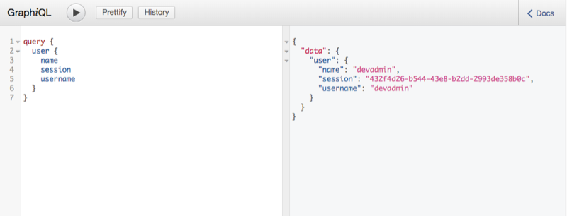
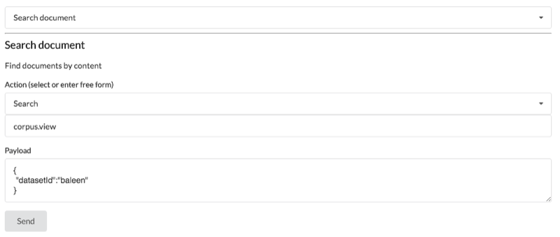
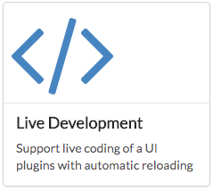

## GraphiQL

The GraphiQL allows for real-time debugging of graphql against Ketos.

## Action development

The action development plugin, if available, allows for actions to be sent through the system programatically.

## Live development

The live development plugin allows you to view your in-development plugin within Ketos' user interface. Ensure that your plugin ui is listening on port 3001 and you are logged in as a development user if authentication is enabled.

