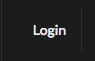
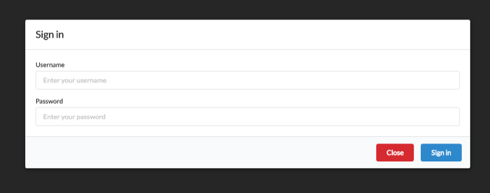
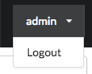

The sign in and sign out button can be found in the top right of the application - only if the authentication is enabled.

When not logged in the application will display a 'Login button' as shown above.  Clicking the login button displays the  username and password sign in form. 

When successfully logged in the top level area becomes a menu, allowing log out.

