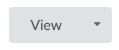
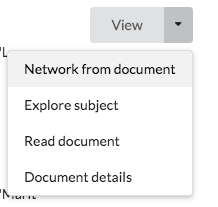

To navigate between plugins you can use the side menu. However we often want to use a piece of data, say a document, as a start point for that plugin.

The Action Dropdown provides a component mechanism for this. It displays a short set of summaries about what actions are available and allows the user to click one to carry it out, opening the data item in the corresponding plugin.

You can click on main part of the button to carry out the default action. Clicking on the down pointing arrow shows a list of other applicable actions. 

Note that not all Ketos deployment have the same plugins, so some options available in one Ketos may not be available in another. 