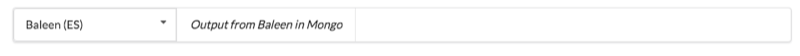
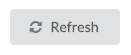

Often a plugin will display or query only a single plugin. The DataSet selector provides a common approach to to allow the user to select a dataset. For convenience the bar will automatically select a dataset. 

For some views there is also a refresh button. This resyncs the current view with the contents of the selected dataset.

