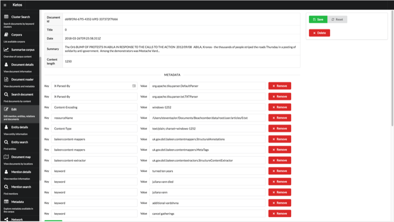

The document editor allows edit and deletion of documents. 

Note that content can not be edited as this would invalidate the mentions annotations offset in a document.

Deletion of document will delete all the relations, entities, and mentions from that document. 

The document editor is within the Editor plugin.