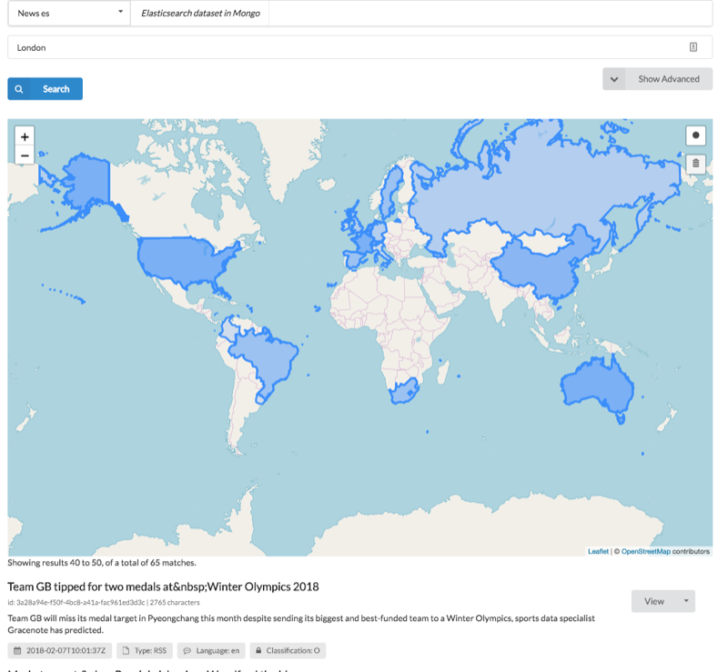

The map explorer provides a document seearch and returns the results displayed alongside a map view of the locations mentioned within the results on that page.

It would be nicer to have a heat map view of all results but the output from Baleen, together with the limitations of various databases, overcomplicated this.